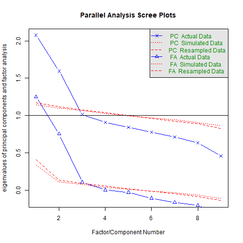
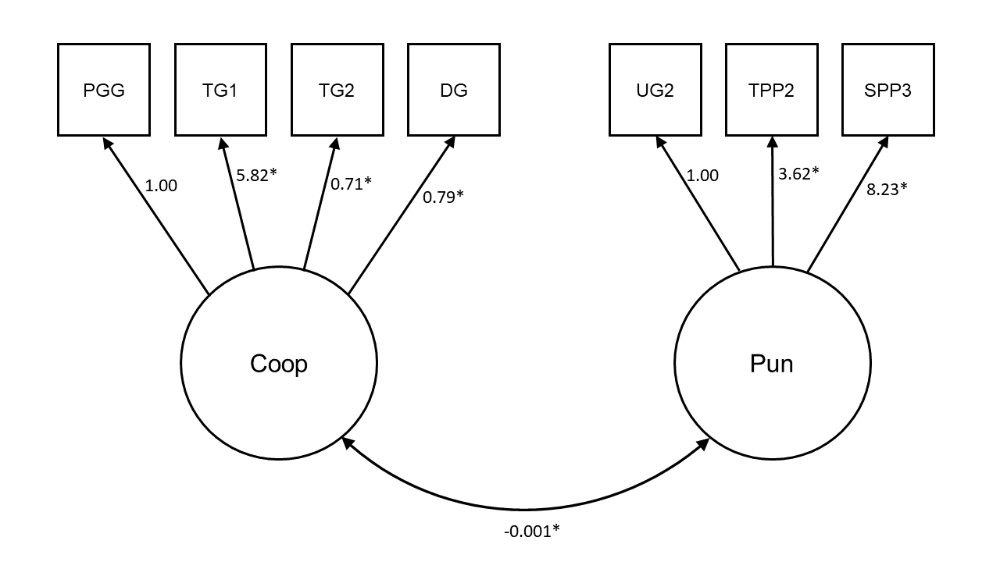
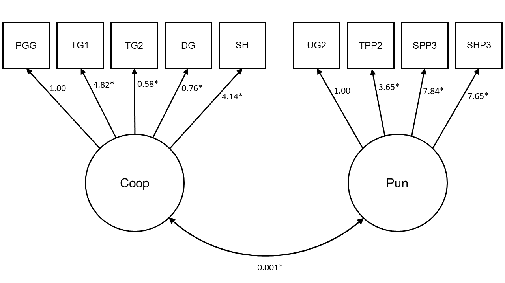
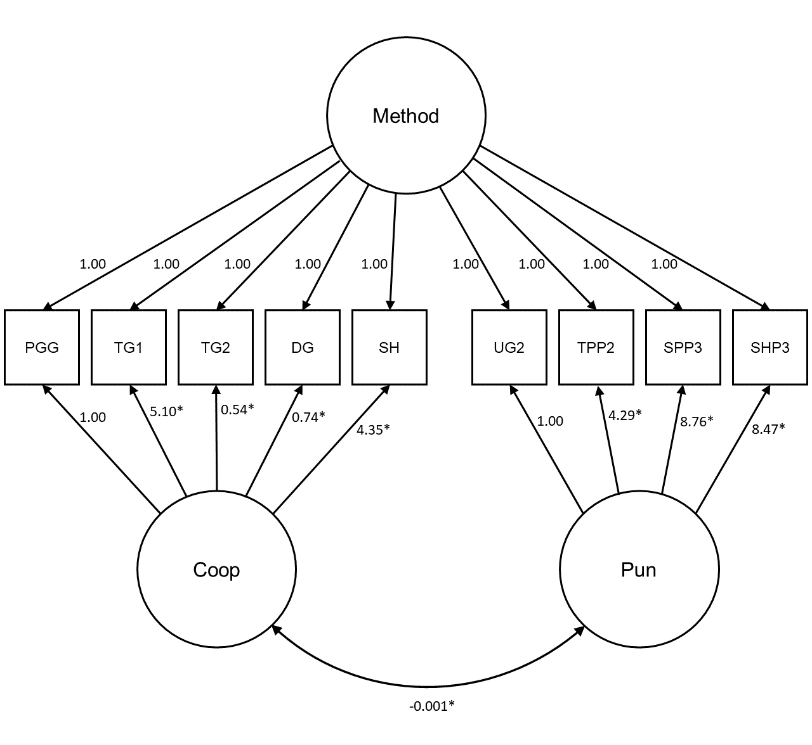

---
output:
  pdf_document: default
  html_document: default
---
\renewcommand{\appendixname}{\textbf{Supplementary Materials}}
\renewcommand{\thefigure}{S\arabic{figure}} \setcounter{figure}{0}
\renewcommand{\thetable}{S\arabic{table}} \setcounter{table}{0}
\renewcommand{\theequation}{S\arabic{table}} \setcounter{equation}{0}
\pagenumbering{gobble}

#

## Supplementary Methods

### Power analysis

The minimum size of our sample was determined by conducting a power analysis on data from previous work[@Peysakhovich2014]. We used the smallest significant correlation between economic game play and real-world cooperation in that study as the effect size (_r_ = 0.15). G*Power[@Faul2007] suggested a sample of 571 participants to detect this correlation effect size with statistical power of 0.95. We aimed to sample 1000 participants, substantially above this amount, and eventually report data from 991 participants.

### Sample frame in Study 1

From the New Zealand Attitudes and Values Study, we included participants in our sample frame who: had completed Wave 4 of the study (_n_ = 12,189); had also completed Wave 9 and/or Wave 10 (_n_ = 8,095); had not subsequently withdrawn from the study at the time of sampling (_n_ = 7,833); had consistently indicated at Wave 9 and 10 that they would be willing to participate in an additional online study (_n_ = 4,181); had a valid email address (_n_ = 4,040); were living in New Zealand (_n_ = 3,955); were younger than 70 at the time of sampling (_n_ = 3,374); and had a valid cell or landline number (_n_ = 3,345). Of these 3,345 participants, we attempted to contact 3,063 about an additional study involving "economic decision-making in groups", and successfully contacted 2,731 about the study.

### Additional information about study sessions in Studies 1 and 2

In Study 1, participants expressed interest in an initial phone call and were then emailed further information about the study. In Study 2, they were just sent an initial email. In both studies, the email asked them to complete a Qualtrics survey to specify their availability the following week. This survey removed any ineligible participants who (1) did not have adequate access to the Internet, (2) did not have a quiet place to participate in the study, and (3) did not have a New Zealand bank account (for payment purposes). 

At the beginning of the study, participants first completed a consent form, in which they were informed of their confidentiality, right to withdraw, payment, and ethical approval. If they agreed to the consent form, participants read information about the economic games and then completed the games in a random order. After being randomly matched at the end of the session, participants saw a payoff screen which summarised the results of each individual game and how much they had earned from the study. Name and bank account details were collected at the end of the study. For security purposes, this information was encrypted while stored online and later decrypted on a local computer for payment. 

Participants had a 55 minute limit to complete the games. If participants took longer than 55 minutes, the software skipped them ahead to the waiting lobby. Timeouts were still paid the \$20 show-up fee, but no bonus payment.

### Uneven session sizes in Studies 1 and 2

In Studies 1 and 2, session sizes were often not strict multiples of four necessary for real-time random matching, either due to unforeseen dropouts or uneven sign-ups. To remedy this, "simulated players" were used to round up uneven session sizes. These simulated players chose responses in the games based on the median responses from previous work[@Peysakhovich2014]. Participants were made aware that they may be matched with simulated players, but only on the payoff screen _after_ all game decisions had been made: "In the rare event that we could not find a participant to match you with, we have instead matched you with average decisions based on previous research."

\newpage

## Supplementary Results

### Confirmatory factor analyses in Study 1

```{r echo=F, warning=F, message=F}
loadd(cfa1)
loadd(cfa2)
loadd(cfa3)
```

As with our principal components analysis, we initially restricted our confirmatory factor model to include only the games used in previous work[@Peysakhovich2014]. Controlling for game comprehension, we loaded the Dictator Game, Trust Game (Give), Trust Game (Return), and Public Goods Game onto the cooperation latent variable, and loaded the Ultimatum Game (Minimum Acceptable Offer), Third-Party Punishment Game (Punish), and Second-Party Punishment Game (Punish Defector) onto the punishment latent variable. According to established fit statistic cutoffs[@Hu1999; @MacCallum1996], this model fitted the data well, with a Root Mean Square Error of Approximation (RMSEA) value of `r printnum(as.numeric(fitMeasures(cfa1)['rmsea']))`, a Standardised Root Mean Square Residual (SRMR) value of `r printnum(as.numeric(fitMeasures(cfa1)['srmr']))`, and a Comparative Fit Index (CFI) value of `r printnum(as.numeric(fitMeasures(cfa1)['cfi']))`. All indicators had significantly positive loadings, and the two latent variables were significantly negatively correlated with one another (_r_ = `r printnum(standardizedSolution(cfa1)[25,4])`, _p_ = `r printp(parameterEstimates(cfa1)[25,7])`; Supplementary Figure \@ref(fig:cfa1Plot)). Model fit improved further when additionally loading the Stag Hunt Game onto the cooperation latent variable and loading the Stag Hunt Game with Punishment (Punish Defector) onto the punishment latent variable (RMSEA = `r printnum(as.numeric(fitMeasures(cfa2)['rmsea']))`; SRMR = `r printnum(as.numeric(fitMeasures(cfa2)['srmr']))`; CFI = `r printnum(as.numeric(fitMeasures(cfa2)['cfi']))`; Supplementary Figure \@ref(fig:cfa2Plot)).

### Confirmatory factor analysis with method factor in Study 1

It is possible that method factors could be influencing the economic game data and generating a two-dimensional factor structure. For example, participants could simply be responding positively to all the games, regardless of their content. To test for the influence of method effects, we also included an additional method factor in the confirmatory factor model. This method factor had loadings from all game decisions, which were all constrained to 1 (i.e., a random intercept), and covariances with the cooperation and punishment factors constrained to 0. Factor loadings were relatively unchanged in this model, with all game decisions loading positively and significantly onto their respective factors (Supplementary Figure \@ref(fig:cfa3Plot)). The model continued to fit the data well (RMSEA = `r printnum(as.numeric(fitMeasures(cfa3)['rmsea']))`; SRMR = `r printnum(as.numeric(fitMeasures(cfa3)['srmr']))`; CFI = `r printnum(as.numeric(fitMeasures(cfa3)['cfi']))`). These results suggest that method factors are not driving the two-dimensional structure of gameplay.

### Structural equation model with method factor in Study 1

```{r echo=F, warning=F, message=F}
loadd(sem8)
```

We also included a method factor, as described above, in our structural equation model to check the robustness of the relationships between gameplay and political ideology to method effects. In this model, we found that SDO continued to significantly negatively predict the cooperation latent variable with a small-to-medium effect size (standardised $\beta$ = `r printnum(standardizedSolution(sem8)[30,4])`, unstandardised _b_ = `r printnum(parameterEstimates(sem8)[30,4])`, 95% confidence interval [`r printnum(parameterEstimates(sem8)[30,8])`, `r printnum(parameterEstimates(sem8)[30,9])`], _p_ `r printp(parameterEstimates(sem8)[30,7])`). SDO also continued to significantly positively predict the punishment latent variable with a small effect size ($\beta$ = `r printnum(standardizedSolution(sem8)[32,4])`, _b_ = `r printnum(parameterEstimates(sem8)[32,4], digits=3)`, 95% CI [`r printnum(parameterEstimates(sem8)[32,8], digits=3)`, `r printnum(parameterEstimates(sem8)[32,9], digits=3)`], _p_ = `r printp(parameterEstimates(sem8)[32,7])`). As in our initial model, we found no significant relationship between RWA and the punishment latent variable ($\beta$ = `r printnum(standardizedSolution(sem8)[33,4])`, _b_ = `r printnum(parameterEstimates(sem8)[33,4], digits=3)`, 95% CI [`r printnum(parameterEstimates(sem8)[33,8], digits=3)`, `r printnum(parameterEstimates(sem8)[33,9], digits=3)`], _p_ = `r printp(parameterEstimates(sem8)[33,7])`) or between RWA and the cooperation latent variable ($\beta$ = `r printnum(standardizedSolution(sem8)[31,4])`, _b_ = `r printnum(parameterEstimates(sem8)[31,4], digits=2)`, 95% CI [`r printnum(parameterEstimates(sem8)[31,8], digits=2)`, `r printnum(parameterEstimates(sem8)[31,9], digits=2)`], _p_ = `r printp(parameterEstimates(sem8)[31,7])`). These results show that method factors cannot explain the observed relationships between gameplay and political ideology.

```{r echo=F, warning=F, message=F}
loadd(cfa4)
loadd(cfa5)
loadd(sem9)
```

### Confirmatory factor analyses and structural equation models with robust estimator

We refitted our main models using a robust estimator (weighted least square mean and variance adjusted estimator) to ensure that our inferences are not biased due to non-normal and ordinal response distributions.

When fitted with this robust estimator, our first confirmatory factor model fitted the data well (RMSEA = `r printnum(as.numeric(fitMeasures(cfa4)['rmsea']))`; SRMR = `r printnum(as.numeric(fitMeasures(cfa4)['srmr']))`; CFI = `r printnum(as.numeric(fitMeasures(cfa4)['cfi']))`). This model loaded cooperative behaviour in the Dictator Game, the Trust Game, and the Public Goods Game onto the "cooperation" latent variable, and punishment of defectors in the Ultimatum Game, Third-Party Punishment Game, and Second-Party Punishment Game onto the "punishment" latent variable. As in our main model, the two latent variables were significantly negatively correlated with one another (_r_ = `r printnum(standardizedSolution(cfa4)[25,4])`, _p_ = `r printp(parameterEstimates(cfa4)[25,7])`). Model fit improved further when additionally loading the Stag Hunt Game onto the cooperation latent variable and loading the Stag Hunt Game with Punishment (Punish Defector) onto the punishment latent variable (RMSEA = `r printnum(as.numeric(fitMeasures(cfa5)['rmsea']))`; SRMR = `r printnum(as.numeric(fitMeasures(cfa5)['srmr']))`; CFI = `r printnum(as.numeric(fitMeasures(cfa5)['cfi']))`).

We additionally fitted our main structural equation model, including SDO and RWA as predictors of the two latent variables, with the robust estimator. Replicating the result of our main model, we found that SDO negatively predicted the cooperation latent variable (standardised $\beta$ = `r printnum(standardizedSolution(sem9)[19,5])`, unstandardised _b_ = `r printnum(parameterEstimates(sem9)[19,5])`, 95% confidence interval [`r printnum(parameterEstimates(sem9)[19,9])`, `r printnum(parameterEstimates(sem9)[19,10])`], _p_ `r printp(parameterEstimates(sem9)[19,8])`) and positively predicted the punishment latent variable (standardised $\beta$ = `r printnum(standardizedSolution(sem9)[21,5])`, unstandardised _b_ = `r printnum(parameterEstimates(sem9)[21,5])`, 95% confidence interval [`r printnum(parameterEstimates(sem9)[21,9])`, `r printnum(parameterEstimates(sem9)[21,10])`], _p_ = `r printp(parameterEstimates(sem9)[21,8])`). By contrast, RWA was unrelated to both the cooperation latent variable (standardised $\beta$ = `r printnum(standardizedSolution(sem9)[20,5])`, unstandardised _b_ = `r printnum(parameterEstimates(sem9)[20,5])`, 95% confidence interval [`r printnum(parameterEstimates(sem9)[20,9])`, `r printnum(parameterEstimates(sem9)[20,10])`], _p_ = `r printp(parameterEstimates(sem9)[20,8])`) and the punishment latent variable (standardised $\beta$ = `r printnum(standardizedSolution(sem9)[22,5])`, unstandardised _b_ = `r printnum(parameterEstimates(sem9)[22,5], digits = 3)`, 95% confidence interval [`r printnum(parameterEstimates(sem9)[22,9], digits = 3)`, `r printnum(parameterEstimates(sem9)[22,10], digits = 3)`], _p_ = `r printp(parameterEstimates(sem9)[22,8])`).

\newpage

## Supplementary Figures

(ref:samplePlotCaption) _Final sample characteristics (n = `r printnum(nrow(readd(d1)))`)._ Education is measured by NZREG, an ordinal scale measuring level of educational attainment (range = 0-10). Socio-economic status (SES) is measured by NZSEI, an ordinal rank measure based on occupational categories (range = 10-90). Local deprivation is measured by NZDEP, an ordinal rank measure of local deprivation for each meshblock in New Zealand (range = 840-1550). Social Dominance Orientation (SDO) and Right Wing Authoritarianism (RWA) are mean scores from six Likert scales (range = 1-7). The map of New Zealand shows meshblock locations for participants.

```{r samplePlot, echo=FALSE, warning=F, message=F, fig.width=10, fig.height=6, fig.cap="(ref:samplePlotCaption)", fig.pos='H', out.width="\\textwidth"}
readd(samplePlot)
```

\newpage

(ref:gamesDistPlotCaption) Histograms showing distributions of decisions in the economic games in Study 1. Each game decision was normalised to vary between 0 and 1. Counts on the y-axis represent numbers of participants. DG = Dictator Game, PGG = Public Goods Game, SH = Stag Hunt Game, SHP1 = Stag Hunt Game with Punishment (Coordinate), SHP2 = Stag Hunt Game with Punishment (Punish Coordinator), SHP3 = Stag Hunt Game with Punishment (Punish Defector), SPP1 = Second-Party Punishment Game (Cooperate), SPP2 = Second-Party Punishment Game (Punish Cooperator), SPP3 = Second-Party Punishment Game (Punish Defector), TG1 = Trust Game (Give), TG2 = Trust Game (Return), TPP1 = Third-Party Punishment Game (Steal), TPP2 = Third-Party Punishment Game (Punish), UG1 = Ultimatum Game (Offer), UG2 = Ultimatum Game (Minimum Acceptable Offer).

```{r gamesDistPlot, echo=FALSE, warning=F, message=F, fig.width=5, fig.height=6, fig.cap="(ref:gamesDistPlotCaption)", fig.pos='H', out.width="\\textwidth"}
readd(gamesDistPlot)
```

\newpage

(ref:screePlotCaption) _Scree plots for (a) the principal components analysis in Study 1 with only the game decisions from previous work and (b) the extended principal components analysis in Study 1 including coordination games._ Principal components analyses initially contained as many factors as there were variables. Both scree plots show that only the first two factors have eigenvalues above 1, indicating a two-factor solution.

```{r screePlot, echo=FALSE, warning=F, message=F, fig.width=8, fig.height=4, fig.cap="(ref:screePlotCaption)", fig.pos='H', out.width="\\textwidth"}
readd(screePlot)
```

\newpage

(ref:parallelPlotCaption) Scree plot from exploratory parallel analysis of economic game decisions. The parallel analysis supported a `r english(readd(parallel)$nfac)`-factor solution.

```{r parallelPlot, echo=FALSE, warning=F, message=F, fig.width=5, fig.height=5, fig.cap="(ref:parallelPlotCaption)", fig.pos='H', out.width="\\textwidth"}

```

\newpage

(ref:indGamesPlotSDOCaption) _Individual game decisions predicting Social Dominance Orientation in Study 1._ Lines are predictions from linear regressions, controlling for Right Wing Authoritarianism, game comprehension, and demographics. Multiple comparisons are accounted for by using a Bonferonni-corrected alpha level. Blue plots are cooperation decisions, orange plots are punishment decisions. Numbers are unstandardised coefficients. *_p_ < .003. DG = Dictator Game, TG1 = Trust Game (Give), TG2 = Trust Game (Return), PGG = Public Goods Game, SH = Stag Hunt Game, UG1 = Ultimatum Game (Offer), TPP1 = Third-Party Punishment Game (Steal), SPP1 = Second-Party Punishment Game (Cooperate), SHP1 = Stag Hunt Game with Punishment (Coordinate), UG2 = Ultimatum Game (Minimum Acceptable Offer), TPP2 = Third-Party Punishment Game (Punish), SPP2 = Second-Party Punishment Game (Punish Cooperator), SPP3 = Second-Party Punishment Game (Punish Defector), SHP2 = Stag Hunt Game with Punishment (Punish Coordinator), SHP3 = Stag Hunt Game with Punishment (Punish Defector).

```{r indGamesPlotSDO, echo=FALSE, warning=F, message=F, fig.width=7, fig.height=4, fig.cap="(ref:indGamesPlotSDOCaption)", fig.pos='H', out.width="\\textwidth"}
readd(indGamesPlotSDO)
```

\newpage

(ref:indGamesPlotRWACaption) _Individual game decisions predicting Right Wing Authoritarianism in Study 1._ Lines are predictions from linear regressions, controlling for Social Dominance Orientation, game comprehension, and demographics. Multiple comparisons are accounted for by using a Bonferonni-corrected alpha level. Blue plots are cooperation decisions, orange plots are punishment decisions. Numbers are unstandardised coefficients. *_p_ < .003. DG = Dictator Game, TG1 = Trust Game (Give), TG2 = Trust Game (Return), PGG = Public Goods Game, SH = Stag Hunt Game, UG1 = Ultimatum Game (Offer), TPP1 = Third-Party Punishment Game (Steal), SPP1 = Second-Party Punishment Game (Cooperate), SHP1 = Stag Hunt Game with Punishment (Coordinate), UG2 = Ultimatum Game (Minimum Acceptable Offer), TPP2 = Third-Party Punishment Game (Punish), SPP2 = Second-Party Punishment Game (Punish Cooperator), SPP3 = Second-Party Punishment Game (Punish Defector), SHP2 = Stag Hunt Game with Punishment (Punish Coordinator), SHP3 = Stag Hunt Game with Punishment (Punish Defector).

```{r indGamesPlotRWA, echo=FALSE, warning=F, message=F, fig.width=7, fig.height=4, fig.cap="(ref:indGamesPlotRWACaption)", fig.pos='H', out.width="\\textwidth"}
readd(indGamesPlotRWA)
```

\newpage

(ref:policyR2PlotCaption) _Bar plots for (a) economic and (b) social policy views showing the proportion of variance explained (R^2^) by the cooperation latent variable, the punishment latent variable, and various demographic controls individually, and their combination in a full model._ In Study 1, the cooperation latent variable explains a comparable proportion of variance in policy views to other demographics.

```{r policyR2Plot, echo=FALSE, warning=F, message=F, fig.width=7, fig.height=6, fig.cap="(ref:policyR2PlotCaption)", fig.pos='H', out.width="\\textwidth"}
readd(policyR2Plot)
```

\newpage

(ref:beastImagesCaption) _Images used in the BEAST task in rounds 1-5 (a-e)._ These images were generated by adapting LIONESS code available at https://github.com/LucasMolleman/Molleman_Kurvers_vandenBos_EHB2019_BEAST

```{r beastImages, echo=FALSE, warning=F, message=F, fig.width=6, fig.height=7, fig.cap="(ref:beastImagesCaption)", fig.pos='H', out.width="\\textwidth"}
readd(beastImages)
```

\newpage

(ref:histRFCaption) _Histogram of rule following decisions in the Rule Following Task in Study 2._

```{r histRF, echo=FALSE, warning=F, message=F, fig.width=7, fig.height=4, fig.cap="(ref:histRFCaption)", fig.pos='H', out.width="\\textwidth"}
readd(histRF)
```

\newpage

(ref:histBEASTCaption) _Histogram of BEAST scores (averaged across all five rounds) in Study 2._

```{r histBEAST, echo=FALSE, warning=F, message=F, warning=FALSE, message=FALSE, fig.width=7, fig.height=4, fig.cap="(ref:histBEASTCaption)", fig.pos='H', out.width="\\textwidth"}
readd(histBEAST)
```

\newpage

(ref:cfa1PlotCaption) _Confirmatory factor model in Study 1 using only the game decisions from previous work._ TG1 is treated as a binary endogenous variable, and paths for PGG and UG2 are constrained to 1. Note that the regression paths controlling for game comprehension are not included in this figure. Numbers are unstandardised coefficients. *_p_ < .050. PGG = Public Goods Game, TG1 = Trust Game (Give), TG2 = Trust Game (Return), DG = Dictator Game, UG2 = Ultimatum Game (Minimum Acceptable Offer), TPP2 = Third-Party Punishment Game (Punish), SPP3 = Second-Party Punishment Game (Punish Defector).

```{r cfa1Plot, echo=FALSE, warning=F, message=F, fig.cap="(ref:cfa1PlotCaption)", fig.pos='H', out.width="\\textwidth"}

```

\newpage

(ref:cfa2PlotCaption) _Confirmatory factor model in Study 1 with additional coordination games._ TG1 and SH are treated as binary endogenous variables, and paths for PGG and UG2 are constrained to 1. Note that the regression paths controlling for game comprehension are not included in this figure. Numbers are unstandardised coefficients. *_p_ < .050. PGG = Public Goods Game, TG1 = Trust Game (Give), TG2 = Trust Game (Return), DG = Dictator Game, SH = Stag Hunt Game, UG2 = Ultimatum Game (Minimum Acceptable Offer), TPP2 = Third-Party Punishment Game (Punish), SPP3 = Second-Party Punishment Game (Punish Defector), SHP3 = Stag Hunt Game with Punishment (Punish Defector).

```{r cfa2Plot, echo=FALSE, warning=F, message=F, fig.cap="(ref:cfa2PlotCaption)", fig.pos='H', out.width="\\textwidth"}

```

\newpage

(ref:cfa3PlotCaption) _Confirmatory factor model in Study 1 with additional coordination games and a shared method factor._ TG1 and SH are treated as binary endogenous variables, and paths for PGG and UG2 are constrained to 1. All loadings for the method factor are constrained to 1. Note that the regression paths controlling for game comprehension are not included in this figure. Numbers are unstandardised coefficients. *_p_ < .050. PGG = Public Goods Game, TG1 = Trust Game (Give), TG2 = Trust Game (Return), DG = Dictator Game, SH = Stag Hunt Game, UG2 = Ultimatum Game (Minimum Acceptable Offer), TPP2 = Third-Party Punishment Game (Punish), SPP3 = Second-Party Punishment Game (Punish Defector), SHP3 = Stag Hunt Game with Punishment (Punish Defector).

```{r cfa3Plot, echo=FALSE, warning=F, message=F, fig.cap="(ref:cfa3PlotCaption)", fig.pos='H', out.width="\\textwidth"}

```

\newpage

## Supplementary Tables

(ref:efaTableCaption) Factor loadings from an exploratory factor analysis of all items from the 16-item SDO scale[@Sidanius1999] and the 30-item RWA scale[@Altemeyer1996]. The factor model was fitted to a separate validation dataset of New Zealand participants (n = `r nrow(readd(dVal))`). The twelve items used in the New Zealand Attitudes and Values Study are emphasised in bold.

```{r efaTable, echo=F, warning=F, message=F}
apa_table(
  readd(efaTable), 
  booktabs = TRUE,
  longtable = TRUE,
  placement = "H",
  caption = "(ref:efaTableCaption)",
  align = c("m{2cm}", "m{11.5cm}", "m{1.5cm}", "m{1.5cm}"),
  escape = FALSE
  )
```

\newpage

(ref:itemTableCaption) Self-report items from the New Zealand Attitudes and Values Study used in both Studies 1 and 2.

```{r itemTable, echo=F, warning=F, message=F}
apa_table(
  readd(itemTable), 
  booktabs = TRUE,
  longtable = TRUE,
  placement = "H",
  caption = "(ref:itemTableCaption)",
  align = c("m{5cm}", "m{10cm}", "m{1.5cm}")
  )
```

\newpage

(ref:compTableCaption) Percentage of participants correctly answering comprehension questions for tasks in Studies 1 and 2. For wording of comprehension questions, see survey materials on OSF: https://osf.io/dwx8g/

```{r compTable, echo=F, warning=F, message=F}
apa_table(
  readd(compTable), 
  booktabs = TRUE,
  placement = "H",
  caption = "(ref:compTableCaption)",
  digits = 0
  )
```

\newpage

(ref:semTableCaption) Summary of the regression coefficients predicting the cooperation and punishment latent variables in the full structural equation model in Study 1.

```{r semTable, echo=F, warning=F, message=F}
apa_table(
  readd(semTable) %>% mutate(p = str_sub(as.character(format(round(p, 3), nsmall = 2)), 2, -1)), 
  booktabs = TRUE,
  placement = "H",
  caption = "(ref:semTableCaption)",
  digits = 3
  )
```

\newpage

(ref:policy01tableCaption) Summary of the regression coefficients predicting preference for income redistribution (1-7) in the full structural equation model in Study 1. Full item: "Redistributing money and wealth more evenly among a larger percentage of the people in New Zealand through heavy taxes on the rich." Dependent variable is treated as ordinal.

```{r policy01table, echo=F, warning=F, message=F}
apa_table(
  readd(policy01table) %>% mutate(p = str_sub(as.character(format(round(p, 3), nsmall = 2)), 2, -1)), 
  booktabs = TRUE,
  placement = "H",
  caption = "(ref:policy01tableCaption)",
  digits = 3
  )
```

\newpage

(ref:policy02tableCaption) Summary of the regression coefficients predicting income attribution (1-7) in the full structural equation model in Study 1. Full item: "Income equality reduces motivation to work hard." Dependent variable is treated as ordinal.

```{r policy02table, echo=F, warning=F, message=F}
apa_table(
  readd(policy02table) %>% mutate(p = str_sub(as.character(format(round(p, 3), nsmall = 2)), 2, -1)), 
  booktabs = TRUE,
  placement = "H",
  caption = "(ref:policy02tableCaption)",
  digits = 3
  )
```

\newpage

(ref:policy03tableCaption) Summary of the regression coefficients predicting willingness to sacrifice for the environment (1-7) in the full structural equation model in Study 1. Full item: "Are you willing to make sacrifices to your standard of living (e.g., accept higher prices, drive less, conserve energy) in order to protect the environment?" Dependent variable is treated as ordinal.

```{r policy03table, echo=F, warning=F, message=F}
apa_table(
  readd(policy03table) %>% mutate(p = str_sub(as.character(format(round(p, 3), nsmall = 2)), 2, -1)), 
  booktabs = TRUE,
  placement = "H",
  caption = "(ref:policy03tableCaption)",
  digits = 3
  )
```

\newpage

(ref:policy04tableCaption) Summary of the regression coefficients predicting support for same-sex marriage (1-7) in the full structural equation model in Study 1. Full item: "Support for same-sex marriage in NZ (The Marriage Amendment Act 2013)." Dependent variable is treated as ordinal.

```{r policy04table, echo=F, warning=F, message=F}
apa_table(
  readd(policy04table) %>% mutate(p = str_sub(as.character(format(round(p, 3), nsmall = 2)), 2, -1)), 
  booktabs = TRUE,
  placement = "H",
  caption = "(ref:policy04tableCaption)",
  digits = 3
  )
```

\newpage

(ref:policy05tableCaption) Summary of the regression coefficients predicting support for euthanasia (1-7) in the full structural equation model in Study 1. Full item: "Suppose a person has a painful incurable disease. Do you think that doctors should be allowed by law to end the patient's life if the patient requests it?" Dependent variable is treated as ordinal.

```{r policy05table, echo=F, warning=F, message=F}
apa_table(
  readd(policy05table) %>% mutate(p = str_sub(as.character(format(round(p, 3), nsmall = 2)), 2, -1)), 
  booktabs = TRUE,
  placement = "H",
  caption = "(ref:policy05tableCaption)",
  digits = 3
  )
```

\newpage

(ref:policy06tableCaption) Summary of the regression coefficients predicting support for abortion (1-7) in the full structural equation model in Study 1. Full item: "Support for legalized abortion for women, regardless of the reason." Dependent variable is treated as ordinal.

```{r policy06table, echo=F, warning=F, message=F}
apa_table(
  readd(policy06table) %>% mutate(p = str_sub(as.character(format(round(p, 3), nsmall = 2)), 2, -1)), 
  booktabs = TRUE,
  placement = "H",
  caption = "(ref:policy06tableCaption)",
  digits = 3
  )
```

\newpage

(ref:policy07tableCaption) Summary of the regression coefficients predicting support for increased payments for those receiving Jobseeker Support (1-7) in the full structural equation model in Study 1. Full item: "Increase payments for those receiving Jobseeker Support (formerly the Unemployment Benefit)." Dependent variable is treated as ordinal.

```{r policy07table, echo=F, warning=F, message=F}
apa_table(
  readd(policy07table) %>% mutate(p = str_sub(as.character(format(round(p, 3), nsmall = 2)), 2, -1)), 
  booktabs = TRUE,
  placement = "H",
  caption = "(ref:policy07tableCaption)",
  digits = 3
  )
```

\newpage

(ref:policy08tableCaption) Summary of the regression coefficients predicting support for increased payments for those receiving Sole Parent Support (1-7) in the full structural equation model in Study 1. Full item: "Increase payments for those receiving Sole Parent Support (formerly the Domestic Purposes Benefit)." Dependent variable is treated as ordinal.

```{r policy08table, echo=F, warning=F, message=F}
apa_table(
  readd(policy08table) %>% mutate(p = str_sub(as.character(format(round(p, 3), nsmall = 2)), 2, -1)), 
  booktabs = TRUE,
  placement = "H",
  caption = "(ref:policy08tableCaption)",
  digits = 3
  )
```

\newpage

(ref:policy09tableCaption) Summary of the regression coefficients predicting support for a flat tax (1-7) in the full structural equation model in Study 1. Full item: "Support for a 'flat' tax rate (everyone pays the same percentage of tax on their income)." Dependent variable is treated as ordinal.

```{r policy09table, echo=F, warning=F, message=F}
apa_table(
  readd(policy09table) %>% mutate(p = str_sub(as.character(format(round(p, 3), nsmall = 2)), 2, -1)), 
  booktabs = TRUE,
  placement = "H",
  caption = "(ref:policy09tableCaption)",
  digits = 3
  )
```

\newpage

(ref:testRetestTableCaption) Test-retest reliability for the economic games from previous work[@Peysakhovich2014] across Studies 1 and 2. Correlations are Spearman's rank correlations (all _p_ < .050). Intra-class correlations are two-way single score agreements across the two studies (all _p_ < .050).

```{r testRetestTable, echo=F, warning=F, message=F}
apa_table(
  readd(testRetestTable), 
  booktabs = TRUE,
  placement = "H",
  caption = "(ref:testRetestTableCaption)",
  digits = 2
  )
```

\newpage

(ref:rfTableCaption) Summary of the fixed effects from the Bayesian multilevel logistic regression model predicting rule following in Study 2.

```{r rfTable, echo=F, warning=F, message=F}
apa_table(
  readd(rfTable),
  booktabs = TRUE,
  placement = "H",
  caption = "(ref:rfTableCaption)",
  digits = 3
  )
```

\newpage

(ref:beastTableCaption) Summary of the fixed effects from the Bayesian multilevel beta regression model predicting BEAST scores in Study 2.

```{r beastTable, echo=F, warning=F, message=F}
apa_table(
  readd(beastTable),
  booktabs = TRUE,
  placement = "H",
  caption = "(ref:beastTableCaption)",
  digits = 3
  )
```

\newpage

(ref:beastPolicyTable04Caption) Summary of the regression coefficients predicting support for same-sex marriage (1-7) in the Bayesian ordinal regression model in Study 2. Full item: Support for "same-sex marriage in NZ (The Marriage Amendment Act 2013)."

```{r beastPolicyTable04, echo=F, warning=F, message=F}
apa_table(
  readd(beastPolicyTable04),
  booktabs = TRUE,
  placement = "H",
  caption = "(ref:beastPolicyTable04Caption)",
  digits = 3
  )
```

\newpage

(ref:beastPolicyTable05Caption) Summary of the regression coefficients predicting support for euthanasia (1-7) in the Bayesian ordinal regression model in Study 2. Full item: "Suppose a person has a painful incurable disease. Do you think that doctors should be allowed by law to end the patient's life if the patient requests it?"

```{r beastPolicyTable05, echo=F, warning=F, message=F}
apa_table(
  readd(beastPolicyTable05),
  booktabs = TRUE,
  placement = "H",
  caption = "(ref:beastPolicyTable05Caption)",
  digits = 3
  )
```

\newpage

(ref:beastPolicyTable06Caption) Summary of the regression coefficients predicting support for abortion for any reason (1-7) in the Bayesian ordinal regression model in Study 2. Full item: Support for "legalized abortion for women, regardless of the reason."

```{r beastPolicyTable06, echo=F, warning=F, message=F}
apa_table(
  readd(beastPolicyTable06),
  booktabs = TRUE,
  placement = "H",
  caption = "(ref:beastPolicyTable06Caption)",
  digits = 3
  )
```

\newpage

(ref:beastPolicyTable10Caption) Summary of the regression coefficients predicting support for abortion when the woman's life is endangered (1-7) in the Bayesian ordinal regression model in Study 2. Full item: Support for "legalized abortion when the woman's life is endangered."

```{r beastPolicyTable10, echo=F, warning=F, message=F}
apa_table(
  readd(beastPolicyTable10),
  booktabs = TRUE,
  placement = "H",
  caption = "(ref:beastPolicyTable10Caption)",
  digits = 3
  )
```

\newpage

(ref:beastPolicyTable11Caption) Summary of the regression coefficients predicting support for religious education in schools (1-7) in the Bayesian ordinal regression model in Study 2. Full item: Support for "including religious instruction in Christianity as part of the school curriculum."

```{r beastPolicyTable11, echo=F, warning=F, message=F}
apa_table(
  readd(beastPolicyTable11),
  booktabs = TRUE,
  placement = "H",
  caption = "(ref:beastPolicyTable11Caption)",
  digits = 3
  )
```

\newpage

(ref:beastPolicyTable12Caption) Summary of the regression coefficients predicting race essentialism (1-7) in the Bayesian ordinal regression model in Study 2. Full item: "To a large extent, a person's race biologically determines his or her abilities."

```{r beastPolicyTable12, echo=F, warning=F, message=F}
apa_table(
  readd(beastPolicyTable12),
  booktabs = TRUE,
  placement = "H",
  caption = "(ref:beastPolicyTable12Caption)",
  digits = 3
  )
```

\newpage

(ref:beastPolicyTable13Caption) Summary of the regression coefficients predicting prejudice against homosexuality (1-7) in the Bayesian ordinal regression model in Study 2. Full item: "I think that homosexuality should be accepted by society" (reversed).

```{r beastPolicyTable13, echo=F, warning=F, message=F}
apa_table(
  readd(beastPolicyTable13),
  booktabs = TRUE,
  placement = "H",
  caption = "(ref:beastPolicyTable13Caption)",
  digits = 3
  )
```
